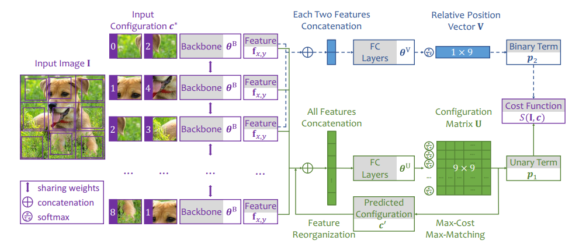

# Unsupervised Visual Recognition by Solving Arbitrary Puzzles
A Tensorflow implementation for the paper:

Iterative Reorganization with Weak Spatial Constraints:<br>
Solving Arbitrary Jigsaw Puzzles for Unsupervised Representation Learning<br>
[Chen Wei](https://weichen582.github.io/), [Lingxi Xie](http://lingxixie.com/), [Xutong Ren](https://tonghelen.github.io/), [Yingda Xia](http://yingdaxia.github.io/), Chi Su, [Jiaying Liu](http://www.icst.pku.edu.cn/struct/people/liujiaying.html), [Qi Tian](http://www.cs.utsa.edu/~qitian/), [Alan L. Yuille](http://cs.jhu.edu/~ayuille/)<br>

[Paper](https://www.cs.jhu.edu/~alanlab/Pubs19/wei2019iterative.pdf)



### Requirements ###
1. Python3
2. Tensorflow >= 1.8.0
3. numpy
4. [munkres-tensorflow](#jump)

### Usage ###
#### Dataset ####
Please download [ILSVRC2012](http://www.image-net.org/challenges/LSVRC/2012/) dataset first. Save the files recording paths and labels of training and validation data at some place, just like `files/val_sub_cls.txt`. `files/val_sub_cls.txt` is a small subset of validation data of ILSVRC2012, which we use for fast validation during the training of the puzzle models. Remember to set the **train_paths_file** flag and the **val_paths_file** flag for training and validation/testing data, respectively.

#### <span id="jump"> Hungarian Algorithm Implementation </span> ####
To fast solve the max-cost max-matching problem, we use [munkres-tensorflow](https://github.com/mbaradad/munkres-tensorflow), a port of Hungarian algorithm C++ implementation to tensorflow interface. Before running the code, please follow the instruction of [munkres-tensorflow](https://github.com/mbaradad/munkres-tensorflow) to compile the function and get *hungarian.so*, which is loaded to the graph by [this line](https://github.com/weichen582/Unsupervised-Visual-Recognition-by-Solving-Arbitrary-Puzzles/blob/78c33ecb3d7d2e5b5ba2e7e81ac888a59ff1434f/models.py#L44). We thank @mbaradad for this helpful repo.


#### Backbone ####
This code base supports AlexNet, ResNet18 (v1) and ResNet50 (v1) as the backbone for feature extraction. Use the **backbone** flag for different architectures.

#### Settings ####
As mentioned in the paper, we equip our models with *unary term*, *binary term* and *mirror augmentatoin*. Each model has unary terms to predict the arbitrary jigsaw puzzles. To turn on binary temrs, set the **binary** flag. To add mirror augmentation, *i.e.*, random left-right flip, include **flip_lr** in the **preprocess** flag.

#### Config ####
`config` contains several shell scripts for you to refer to, which are to train or evaluate a model for solving arbitrary jigsaw puzzles. The **experiment_name** flag is necessary to indicate a specific experiment.

#### Models ####
We provide the tensorflow [checkpoints](https://drive.google.com/drive/folders/1G-0cBAUnaiGPDg0hP0-ljkaKj4EJvZEk?usp=sharing) of solving arbitary jigsaw puzzles, hosted by Google Drive. You can also test the puzzle solving performance of the models by using the [eval_puzzle_alexnet.sh](https://github.com/weichen582/Unsupervised-Visual-Recognition-by-Solving-Arbitrary-Puzzles/blob/78c33ecb3d7d2e5b5ba2e7e81ac888a59ff1434f/config/eval_puzzle_alexnet.sh) with the checkpoint saved in the *local_save_dir* defined at this [line](https://github.com/weichen582/Unsupervised-Visual-Recognition-by-Solving-Arbitrary-Puzzles/blob/78c33ecb3d7d2e5b5ba2e7e81ac888a59ff1434f/main.py#L288).

#### Transfer Learning ####
We use this [VOC-Classification Repo](https://github.com/jeffdonahue/voc-classification) to evaluate our models on V0C2007 classification task. We use this [Fast R-CNN Repo](https://github.com/rbgirshick/fast-rcnn) to evalute our models on VOC2007 detection task. The tensorflow models are converted to caffe models to fit into these repos.
 
### Citation ###
 ```
 @inproceedings{chen2019iterative,
  title={Iterative Reorganization with Weak Spatial Constraints: Solving Arbitrary Jigsaw Puzzles for Unsupervised Representation Learning},
  author={Chen Wei, Lingxi Xie, Xutong Ren, Yingda Xia, Chi Su, Jiaying Liu, Qi Tian, Alan L. Yuille},
  booktitle={Computer Vision and Pattern Recognition},
  year={2019}
}
```

Some codes are based on [Revisiting-SSL repo](https://github.com/google/revisiting-self-supervised), which provides some insightful experimental results for Self-Supervised Learning.
 
